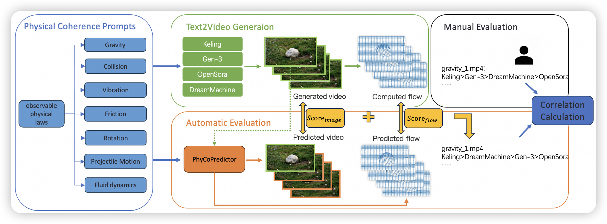

## ___***A Physical Coherence Benchmark for Evaluating Video Generation Models via Optical Flow-guided Frame Prediction***___

 
##  PhyCoBench
<div align=center>
Recent advances in video generation models demonstrate their potential as world simulators, but they often struggle with videos deviating from physical laws, a key concern overlooked by most text-to-video benchmarks. We introduce a benchmark designed specifically to assess the Physical Coherence of generated videos, PhyCoBench. Our benchmark includes 120 prompts covering 7 categories of physical principles, capturing key physical laws observable in video content. We evaluated four state-of-the-art (SoTA) T2V models on PhyCoBench and conducted manual assessments. Additionally, we propose an automated evaluation model: PhyCoPredictor, a diffusion model that generates optical flow and video frames in a cascade manner. Through a consistency evaluation comparing automated and manual sorting, the experimental results show that PhyCoPredictor currently aligns most closely with human evaluation. Therefore, it can effectively evaluate the physical coherence of videos, providing insights for future model optimization. 

## Updatas
[2025/1/1] Added training codes and inference codes.
[2025/1/5] Added a demo for evaluating generated videos.
[2025/1/7] Released our 120 prompts.


## Installation
`conda create -n PhyCoBench python=3.8`
`conda activate PhyCoBench`
`pip install -r requirements.txt`

## Evaluation
1.Prepare the generated videos and the corresponding text prompts.
2.Run the following commands.
```
bash scripts/run_eval.sh
```
Then you can obtain the benchmark scores for the video.

## Training PhyCoPredictor
Our PhyCoPredictor comprises two diffusion models, thus requiring a two-stage training process. In stage one, we train the latent flow diffusion module, and in stage two, we train the latent video diffusion module.
1.Stage One
Train the latent flow diffusion module from scratch.
`bash configs/train_sh/run_latent_flow.sh`
Then modify the configuration file to add the model weights trained in the previous step as the pre-trained model, and proceed with further fine-tuning training.
`bash configs/train_sh/run_latent_flow.sh`
2.Stage Two
Train the latent video diffusion module with [DynamiCrafter](https://huggingface.co/Doubiiu/DynamiCrafter_512/blob/main/model.ckpt) pre-trained model.
`bash configs/train_sh/run_visual_flow.sh`

## Acknowledgement
Part of our code was borrowed from [flowformer++](https://github.com/XiaoyuShi97/FlowFormerPlusPlus), [DynamiCrafter](https://github.com/Doubiiu/DynamiCrafter). We thank all the authors of these repositories for their valuable implementations.